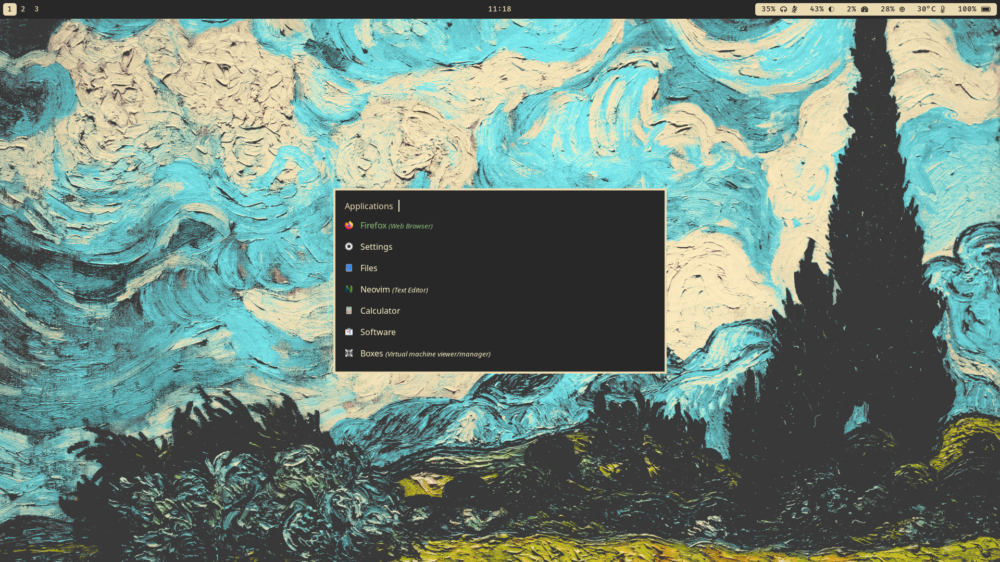
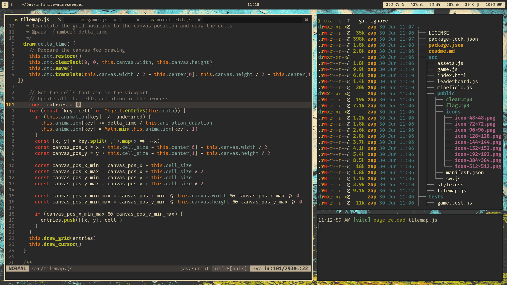
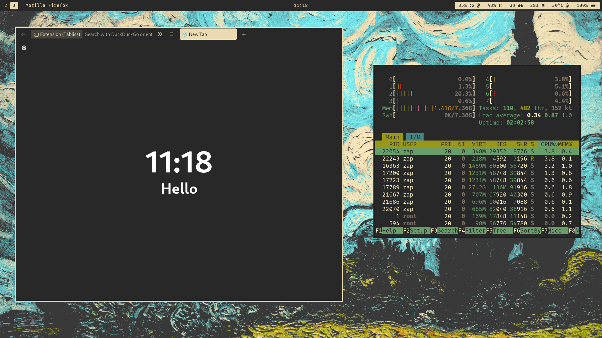

# Zap's dotfiles

Just some configuration I made to learn more about Linux and desktop operating system in general, optimizing my workflow and making something that looks good.





## Information

- OS: [Fedora Linux](https://getfedora.org/) (but it should work with other distros)
- WM: [sway](https://swaywm.org/)
- Shell: [zsh](https://www.zsh.org/)
- Editor: [neovim](https://neovim.io/)
- Terminal: [kitty](https://sw.kovidgoyal.net/kitty/)
- Browser: [firefox](https://www.mozilla.org/en-US/firefox/)
- Launcher: [rofi](https://github.com/davatorium/rofi)
- Bar: [waybar](https://github.com/Alexays/Waybar)
- Colorscheme: [gruvbox](https://github.com/morhetz/gruvbox)

### Missing features

- Change brightness by scrolling with bar icon
- Change volume with function key
- Notification and notification center
- Media control panel
- Lock screen
- Wifi and bluetooth configuration menu
- Ibus

## Required packages

### Fedora 36

All packages can be installed with dnf
```
sudo dnf install https://mirrors.rpmfusion.org/free/fedora/rpmfusion-free-release-$(rpm -E %fedora).noarch.rpm

sudo dnf install @multimedia sway kitty waybar rofi zsh zsh-autosuggestions zsh-syntax-highlighting starship exa bat sqlite neovim nodejs npm python3 python3-pip git gcc ripgrep fd-find clang-tools-extra
```

### Fedora Everything

The setup needs to be more complete and functional before it can be used without a secondary DE.

So I don't recommend setting this up on a minimal Linux installation like Arch, Fedora Everything or Gentoo.

Once I'm satisfied with the setup I'll update this section. 

## Installation

```sh
# Install FiraCode NF font
git clone --depth=1 https://github.com/ryanoasis/nerd-fonts
cd nerd-fonts
./install.sh FiraCode
cd ..

# Install required packages (see above)

# Clone this repo
git clone --depth=1 https://github.com/ziap/dotfiles
cd dotfiles

# Setup zsh
sudo chsh -s $(which zsh)
cp .zshrc ~

# Copy config files
cp -r .config/* ~/.config/

# Install vim-plug
sh -c 'curl -fLo "${XDG_DATA_HOME:-$HOME/.local/share}"/nvim/site/autoload/plug.vim --create-dirs \
       https://raw.githubusercontent.com/junegunn/vim-plug/master/plug.vim'

# Install Neovim language servers
sudo npm i -g pyright vscode-langservers-extracted typescript typescript-language-server
```

Log out from your current session and login to sway

# License

This project is unlicensed and belongs to the public domain.
