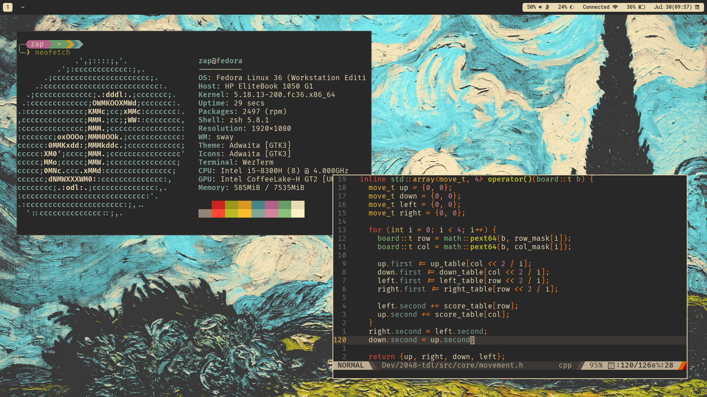
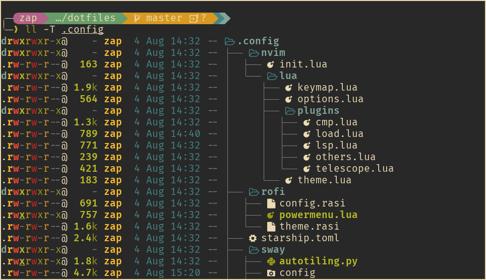
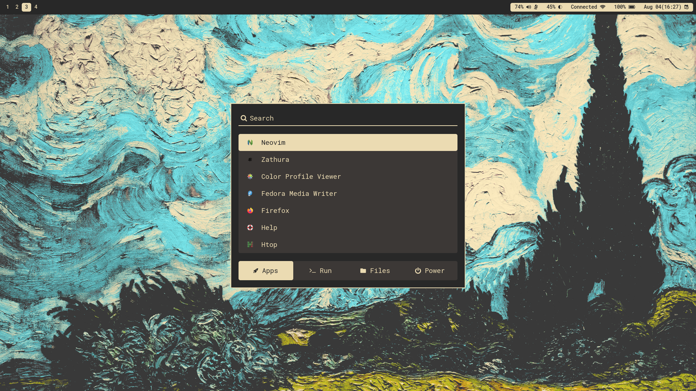
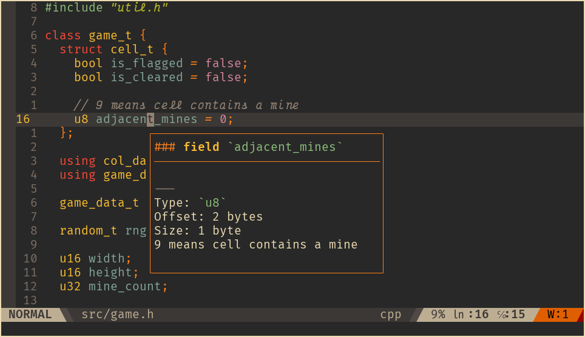

<div align="center">

# SwayWM dotfiles

A custom wayland desktop environment fine-tuned to my development workflow and daily usage.

</div>

## Informations



- OS: [Fedora Linux](https://getfedora.org/)
- WM: [sway](https://swaywm.org/)
- Shell: [zsh](https://www.zsh.org/)
- Editor: [neovim](https://neovim.io/)
- Terminal: [wezterm](https://wezfurlong.org/wezterm/)
- Browser: [firefox](https://www.mozilla.org/en-US/firefox/)
- Launcher: [rofi](https://github.com/davatorium/rofi)
- Bar: [waybar](https://github.com/Alexays/Waybar)
- Colorscheme: [gruvbox](https://github.com/morhetz/gruvbox)

### Features

- ✨ Minimal and aesthetic gruvbox themed desktop
- 🍱 Window management with autotiling
- 🗨️  Lightweight yet powerful ZSH shell with starship prompt
- 🚀 Functional developer environment for
    + C and C++
    + Vanilla web development
    + Python
- 📄 Document editing with markdown, latex, pandoc and reveal.js
- 📁 File browsing and application launcher with rofi
- 📷 Screenshot with support for
    + Region
    + Window
    + Screen
- 🔌 Power menu and a very basic lock screen
- 🔧 Essential Fedora modification (rpmfusion, codecs) included in the install script

### Plan

- Add more rofi menus
- Rust, Svelte development environment
- Notification with dunst
- Setup on a more minimal Fedora installation

## Installation

### Clone repository

```bash
git clone --depth=1 https://github.com/ziap/dotfiles
cd dotfiles

cp -rp .config ~
```

### RPMFusion and media codecs

```bash
sudo dnf install https://mirrors.rpmfusion.org/free/fedora/rpmfusion-free-release-$(rpm -E %fedora).noarch.rpm

sudo dnf install @multimedia
```

### Fonts

Install fonts to local font directory `~/.local/share/fonts`

Fonts being used are:
  - FiraCode (terminal, editor font)
  - VictorMono (italic font)
  - RobotoMono (UI font)

```bash
# Install fonts
cp -rp .local ~
```

### Terminal + Shell setup



Install wezterm

```bash
sudo dnf install https://github.com/wez/wezterm/releases/download/20220624-141144-bd1b7c5d/wezterm-20220624_141144_bd1b7c5d-1.fc36.x86_64.rpm
```

Install and setup zsh, some plugins and starship prompt

```bash
sudo dnf install util-linux-user zsh zsh-autosuggestions zsh-syntax-highlighting starship

chsh -s $(which zsh)
cp .zshrc ~ 
```

Install extra packages

```bash
sudo dnf install sqlite ImageMagick bat exa ripgrep fd-find skim
```

- `sqlite`: for dnf autocompletion
- `ImageMagick`: for command line image editing
- `bat`, `exa`: Syntax highlighting, icons for `cat` and `ls`
- `ripgrep`, `fd-find`: Faster `grep` and `find`
- `skim`: Fuzzy finder

### Desktop environment setup



```bash
sudo dnf install sway rofi waybar luajit slurp grim light pulseaudio-utils wl-clipboard
```

- `luajit`: Run Lua rofi scripts
- `grim`, `slurp`: Screenshot tool
- `light`, `pulseaudio-utils`: Control screen brightness and audio volume
- `wl-clipboard`: Clipboard tool

### Developer environment setup



The packages for each programming languages are pretty self-explanatory

```bash
sudo dnf install neovim git python3 python3-pip nodejs npm gcc gcc-c++ clang-tools-extra
```

Install language servers

```bash
sudo npm i -g pyright vscode-langservers-extracted typescript \
  typescript-language-server emmet-ls
```

Install plugins

```bash
sh -c 'curl -fLo "${XDG_DATA_HOME:-$HOME/.local/share}"/nvim/site/autoload/plug.vim --create-dirs \
       https://raw.githubusercontent.com/junegunn/vim-plug/master/plug.vim'

nvim -c PlugInstall
```

### Firefox setup


- Gruvbox cascade [userChrome.css](https://gist.github.com/ziap/be9576c3bcdcb7de6b47a2ba45aa3725)
- [Dark reader](https://darkreader.org/) with gruvbox theme

### Document editing workflow setup

```bash
sudo dnf install pandoc texlive zathura zathura-pdf-mupdf

# Make zathura the default pdf reader
xdg-mime default org.pwmt.zathura.desktop application/pdf
```

### IME Setup

```bash
sudo dnf install fcitx5 fcitx5-qt fcitx5-gtk fcitx5-configtool
sudo dnf install fcitx5-unikey # Or your IME
```

Write these to `/etc/environment`

```bash
GTK_IM_MODULE=fcitx
QT_IM_MODULE=fcitx
XMODIFIERS=@im=fcitx
```

You can automatically start fcitx by adding `exec_always fcitx5` to sway config but I prefer manually starting it in rofi.

# License

This project is licensed under the [GPL-3.0 license](LICENSE).
