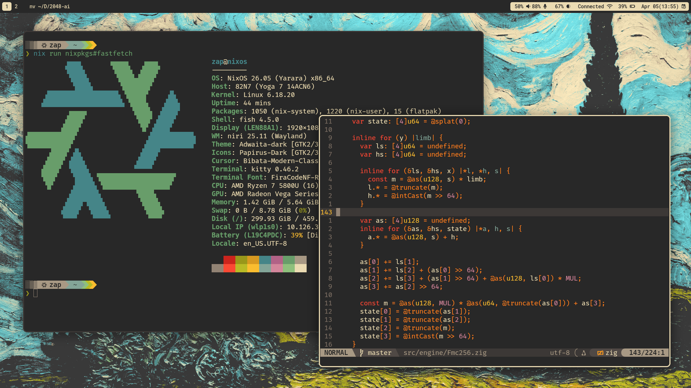

<div align="center">

# Zap's NixOS dotfiles

My custom environment ported to NixOS and managed with home-manager

</div>

## Informations



- OS: [NixOS](https://nixos.org/)
- WM: [Niri](https://github.com/YaLTeR/niri/)
- Shell: [Fish](https://fishshell.com/) with [Starship prompt](//starship.rs/)
- Editor: [Neovim](https://neovim.io/)
- Terminal: [Kitty](https://sw.kovidgoyal.net/kitty/)
- Browser: [Firefox](https://www.mozilla.org/en-US/firefox/)
- Launcher: [Rofi](https://github.com/davatorium/rofi)
- Bar: [Waybar](https://github.com/Alexays/Waybar)
- Colorscheme: [Gruvbox](https://github.com/morhetz/gruvbox)

## Screenshots

TBA

## Installation

Flake-ify your `configuration.nix` and add the dotfiles as an input:

```nix
{
  description = "Your NixOS system configuration";

  inputs = {
    nixpkgs.url = "github:nixos/nixpkgs/nixos-unstable";
    dotfiles = {
      url = "github:ziap/dotfiles-nixos";
      inputs.nixpkgs.follows = "nixpkgs";
    };
  };

  outputs = { self, nixpkgs, dotfiles }: {
    nixosConfigurations.nixos = nixpkgs.lib.nixosSystem {
      system = "x86_64-linux";
      modules = [
        ./configuration.nix
        dotfiles.nixosModules.userConfig
      ];
    };
  };
}
```

Rebuild the system with the included configuration

```bash
sudo nixos rebuild switch
```

Clone the repository

```bash
git clone https://github.com/ziap/dotfiles-nixos dotfiles
cd dotfiles
```

Install and activate home-manager

```bash
nix run . -- switch --flake .
```

# License

This project is licensed under the [GPL-3.0 license](LICENSE).
